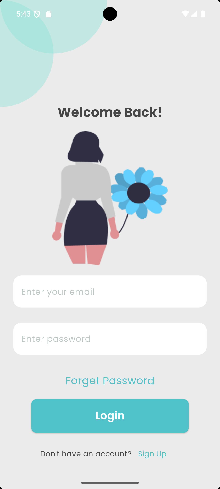

# Easy-Lingua

A powerful and user-friendly flashcard application built with Flutter. Easy-Lingua helps users learn new words and phrases efficiently using a customizable flashcard system.

---

## Özellikler / Features

- **Akıllı Kart Sistemi / Smart Flashcard System**: Kullanıcılar kelimeleri kartlar halinde öğrenebilir.
- **Özelleştirilebilir Kartlar / Customizable Cards**: Kullanıcılar kendi kelime kartlarını oluşturabilir.
- **Kullanıcı Dostu Arayüz / User-Friendly UI**: Basit ve sezgisel tasarım ile kolay kullanım.
- **Kategori Desteği / Category Support**: Kelime kartlarını farklı kategorilere ayırma imkânı.
- **Hafif ve Hızlı / Lightweight and Fast**: Optimum performans sunan minimalist bir uygulama.

---

## Kullanılan Teknolojiler / Technologies Used

- **Dil/Framework / Language/Framework**: Dart & Flutter
- **Veritabanı / Database**: [Specify database, e.g., SQLite, Firebase, etc.]
- **Diğer Araçlar / Other Tools**: [örn. Provider, GetX, vb. / e.g., Provider, GetX, etc.]

---

## Kurulum / Installation

Bu projeyi yerel ortamınıza kurmak için aşağıdaki adımları izleyin:

Follow these steps to set up the project locally:

1. **Depoyu Kopyalayın / Clone the Repository**

   ```bash
   git clone https://github.com/YenerCenger/Easy-Lingua.git
   cd Easy-Lingua
   ```

2. **Flutter Kurulumu / Install Flutter**

   Bilgisayarınıza Flutter kurulu olduğundan emin olun. Kurulu değilse [Flutter kurulum kılavuzu](https://docs.flutter.dev/get-started/install) bağlantısını takip edin.

   Ensure Flutter is installed on your system. If not, follow the [Flutter installation guide](https://docs.flutter.dev/get-started/install).

3. **Bağımlılıkları Yükleyin / Install Dependencies**

   ```bash
   flutter pub get
   ```

4. **Uygulamayı Çalıştırın / Run the Application**

   ```bash
   flutter run
   ```

5. **Uygulamaya Erişim / Access the Application**

   Emülatör ya da fiziksel cihaz üzerinden uygulamayı çalıştırabilirsiniz.
   Run the app on an emulator or a physical device connected to your system.

---

## Proje Yapısı / Project Structure

```plaintext
Easy-Lingua/
├── lib/                 # Ana uygulama mantığı / Main application logic
│   ├── models/          # Veri modelleri / Data models
│   ├── screens/         # UI ekranları / UI screens
│   ├── widgets/         # Tekrar kullanılabilir bileşenler / Reusable widgets
│   └── main.dart        # Uygulama giriş noktası / Entry point of the app
├── assets/              # Varlıklar (resimler, yazı tipleri) / Assets like images, fonts
├── pubspec.yaml         # Proje bağımlılıkları / Project dependencies
├── README.md            # Dokümantasyon / Documentation
└── ...                  # Diğer dosyalar ve klasörler / Other files and folders
```

---

## Katkıda Bulunma / Contributing

Katkılar memnuniyetle kabul edilir! Lütfen şu adımları takip edin:

Contributions are welcome! Please follow these steps:

1. Depoyu kopyalayın / Fork the repository.
2. Yeni bir dal oluşturun / Create a new branch for your feature or bugfix.
3. Değişikliklerinizi işleyip kopyalanmış deponuza gönderin / Commit your changes and push them to your fork.
4. Bir pull request gönderin / Submit a pull request.

---

## Lisans / License

Bu proje MIT Lisansı altında lisanslanmıştır. Daha fazla bilgi için LICENSE dosyasına bakın.

This project is licensed under the MIT License. See the LICENSE file for details.

---

## İletişim / Contact

Sorularınız veya geri bildirimleriniz için benimle iletişime geçebilirsiniz:

If you have any questions or feedback, feel free to contact me:

- GitHub: [YenerCenger](https://github.com/YenerCenger)
- Email: [Yener35cenger@gmail.com](mailto:Yener35cenger@gmail.com)

---

## Ekran Görüntüleri / Screenshots

Aşağıda uygulamanın bazı ekran görüntülerini bulabilirsiniz:

Below are some screenshots of the app:





